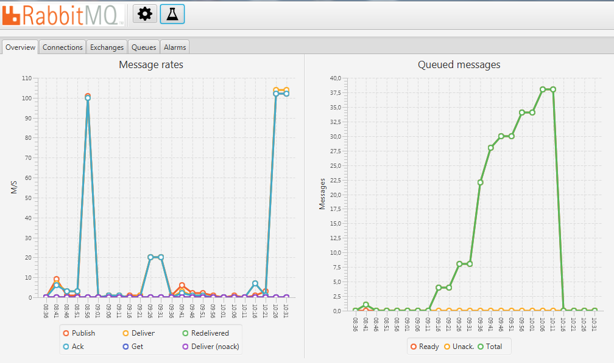

# sungura #

## RabbitMQ Monitoring Tool ##

This is a mini **Scala** project based on *JavaFX 8*, *ScalaFx*, *ScalaFxml*, *Spray* and *Akka*. This project is an attempt to build a RabbitMQ monitoring desktop tool client based on HTTP API of RabbitMQ management plugin.

The purpose of this project is to build an application by following some design principles of reactive programing.  I focused mainly on message driven design based on Akka actors system. It is my first experience on this framework.

It is also my first approach to both JavaFX and the ScalaFX UI DSL. ScalaFX is a DSL for JavaFX. 

